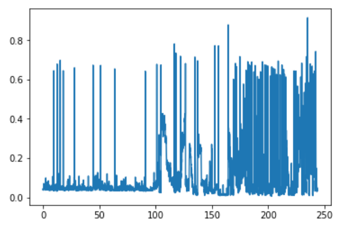

## Week 2 - Scene Boundary Detection
Scene Boundary Detection seemed like it was worth giving a shot at. So I decided to read more about it this week and try to write some code for the same. 

I went through a couple more papers,
* <a href="https://arxiv.org/pdf/1510.08893.pdf">A Deep Siamese Network for Scene Detection in Broadcast Videos</a>.
* <a href="http://ieeexplore.ieee.org.sci-hub.tw/xpl/artic%C2%ADleDetails.jsp?arnumber=7177476">Scene Segmentation using Temporal Clustering for accessing and re-using broadcast video</a>

but I couldn't find any pre-implemented/ publicly available code for ScBD online, so I decided to code it out on a naive scale to test if it'd work on our dataset.

### SSIM similarity between consecutive frames:
For ScBD, the naive, vague idea is to find where the video changes visually. So I used an image-similarity metric called <a href="https://en.wikipedia.org/wiki/Structural_similarity">SSIM</a> to go frame by frame in the video, compute the SSIM between two consecutive frames, and then plotted the results using matplotlib. 

What I ended up re-inventing was shot boundary detection as the SSIM changes by a lot even when the camera shifts/pans slightly. In the plot above, the portion to the right had denser 'spikes' than to the left. I looked at what was going on and found out that advertisements were playing in the video where spikes are noted. Since advertisements are usually 'faster' than TV shows, in order to convey their message quickly, they resort to quick change of shots which is what resulted in our unusual plot. I noted this down so that maybe we could use this characteristic to segment advertisements in the future. 

### Keyframe clustering:
A <b>keyframe</b> is a frame taken out of a shot that 'represents' that shot. To compare two shots, we only need to compare their keyframes. For this week, we just took the middle frame of the shot as its keyframe but we try and improve this in the following weeks.  
Going back to our original idea of 'grouping' a bunch of consecutive shots based on their visual similarity, I wrote some code to iterate through shots temporally, and compare the keyframe from the current shot to the keyframes from each of the previous shots to see if it matches any of them i.e., we try to find where this particular camera angle/shot was used previously in the video. If it matches any previous shot, we assign it the same class as that shot. For a small news show clip of 12 shots, I tested out this method and the results were: 
<b>0 1 1 2 2 1 0 1 2 1 0 1</b> 

Since the first and the penultimate shots are the same, all shots between these must belong to the same show. Since the second and the last shots are the same, all shots between them must also belong to the same show, hence using this method we could conclusively tell that the duration through these 12 shots belongs to the same show (atleast for this particular clip).

In the following week, we try to use a better metric for image-similarity to make the algorithm more objective.

 The notebook with the basic gist of this week's methodology is available <a href="https://github.com/eonr/ShowSegmentation/blob/master/W1&2-Keyshots/Keyshots.ipynb">here</a>.