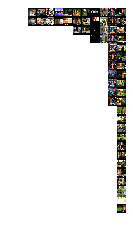

## Week 3 - Hierarchial clustering of Keyframes
As promising as the results were for that small clip, I had to fine-tune the similarity threshold a bit to get the final result. This is bad because this threshold would be different for different shows based on the colors/ camera angles in the video. So we decided to use a Deep Neural Network to try and get more objective results. 

### Clustering VGG-16 features

SSIM's problem was that it applied its algorithm on raw pixel values, which was a big part of its bias/subjectivity. 
So, for this week I was looking to extract features out of keyframes using some popular DNN Model and cluster keyframes based on these features. Luckily, I found an opensourced library online which does exactly this.  <a href="https://github.com/elcorto/imagecluster">Imagecluster</a> is a python library that takes a bunch of images as input, extracts their features using a pretraind VGG-16 network and clusters them using <a href="https://en.wikipedia.org/wiki/Hierarchical_clustering">Hierarchial clustering</a>. I automated the process of finding out all the keyframes from a video and storing them in a directory. This directory is then given as an input to Imagecluster. The image below is a summary of the algorithm's output on our original small clip. Each column denotes a cluster and each image in a column is a keyframe.

The last column in the image is an advertisement (as discussed in week-2, has a lot of shots in a small duration).  The column before that is of the 4 minute news show clip. The results are as desired but a few old drawbacks still exist:
* The algorithm doesn't take time into consideration and hence sometimes clusters frames that are very far away.
* The main function of the algorithm has a parameter 'similarity' which still needed a bit of fine-tuning despite using DNN features.
* The algorithm is kind of heavy on RAM.

### Extracting faces from the video
One of the plans we had for the project from the beginning was to extract faces from the video and infer details about the boundary from this information (we'll discuss how in the following weeks). So on the side, I wrote some code to extract all faces from the video using <a href="https://github.com/ageitgey/face_recognition">face_recognition</a>, crop them out from the frame and store them in a directory. Each face's .jpg file will be named according to its time of occurrence in the video. 
  
Until now, we've been using the middle frame of each shot as its keyframe. In the following week, we try to improve the keyframe extraction process and also try to cluster the faces we just extracted from the video.